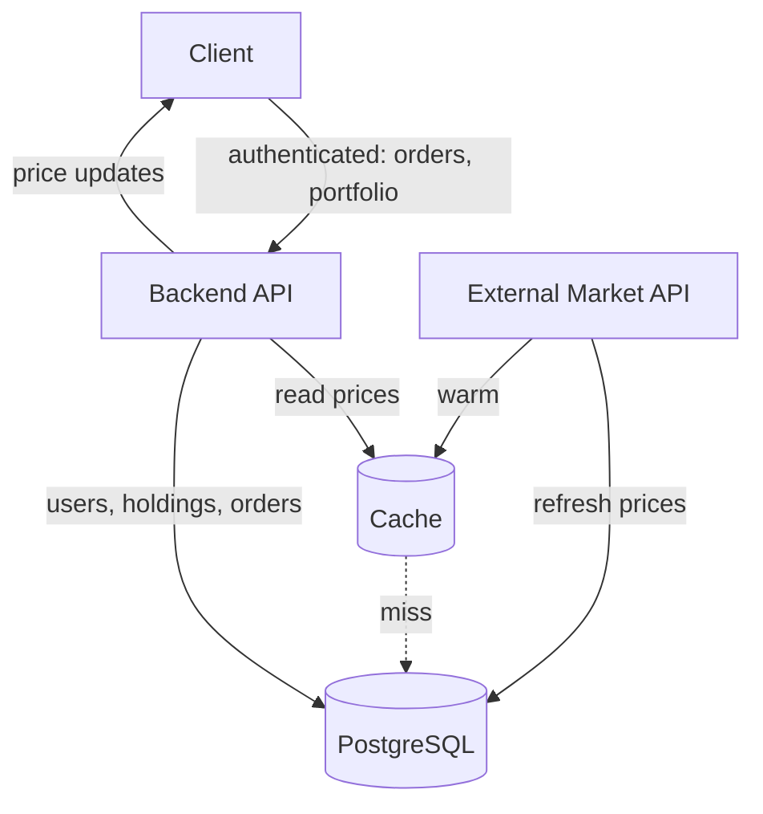
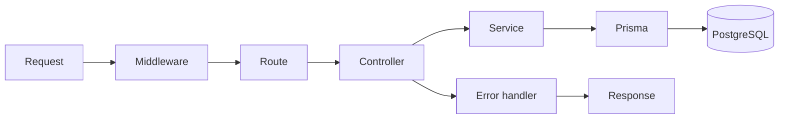
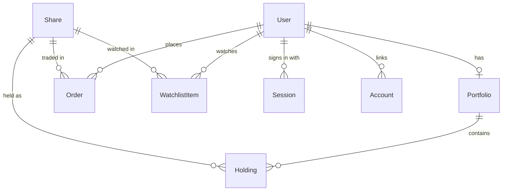

# Binks Trade

A safe harbor where beginners sail, learn, and grow in real markets.

Paper trading for Indian equities. Real market prices, virtual money, so people
learning to trade can make their expensive mistakes for free.

## Why

Most people learning the markets pick between theory that never sticks and
risking real money before they understand what they are doing. Binks Trade is the
middle option: a real trading loop running on live prices, with virtual cash.

Every account opens with ₹1,00,000 in practice money. It cannot be deposited,
withdrawn, or exchanged for real currency.

## Architecture



Prices live in three places, each doing a different job. The cache is the hot read
path. Postgres holds the durable record on the `Share` table, so a cold cache or an
unreachable feed still leaves something to serve, and `priceUpdatedAt` marks how
stale that row is. The external market API is the source of truth, and a refresh
writes through to Postgres as well as the cache.

Reads fall back down that chain: cache, then Postgres, then the external feed if
the stored price is too old. User data, holdings, and orders only ever touch
Postgres.

Prices are delayed rather than live, so the feed is polled on a schedule and the
transport for pushing updates to the client is still an open decision rather than
an automatic WebSocket.

### Request path



Middleware chain: `helmet`, `cors`, rate limiter, body parser, cookie parser.
Protected routes pass through an `authenticate` guard that resolves the session
cookie to a user before the controller runs.

## Design decisions

### Opaque sessions instead of JWTs

The original design called for JWTs. It ships with server side sessions instead: a
single 7 day cookie holding a 256 bit random token, stored in the database as a
SHA-256 hash.

A stateless JWT cannot be revoked, which makes logout a polite fiction. Here
logout sets `revokedAt` and the session is dead on the next request. The token is
hashed at rest for the same reason passwords are. A database leak should not hand
over live sessions.

Logout stays public. It revokes whatever session the cookie names, and an expired
or unknown cookie is a no-op, so there is nothing for a guard to protect.

### Signup is one transaction

Creating a user also creates their portfolio and its opening cash grant, in a
single Prisma nested write. A user without a portfolio is a broken account, and
eventual consistency here would mean landing on an empty dashboard with no money.

### Decimal for every monetary value

Floating point rounding in a trading application is not an acceptable class of
bug.

### Holdings aggregate, orders append

One holding row per `(portfolio, share)` carrying `quantity` and `avgBuyPrice`,
with a composite unique constraint. Order history is the append only log. Holdings
are the derived current position.

### Orders record intent and outcome separately

`price` is what the user asked for, `executedPrice` is what they got, and `status`
moves through `PENDING` to `FILLED` or `CANCELLED`. Modelling the real order
lifecycle now means limit orders and partial fills will not need a migration.

### The contract lives in one package

`@binks/types` exports the Zod schemas and the `User` shape that both the API and
the web client build against. Both sides enforce identical rules and surface
identical error messages, and a change to either is a compile error on whichever
side has not caught up.

## Data model



`Session` backs authentication. `Account` exists for OAuth providers. That table
and the nullable `passwordHash` are already in place so Google sign in can be
added without a migration.

## API

| Method | Endpoint | Auth |
| --- | --- | --- |
| `POST` | `/auth/signup` | Public |
| `POST` | `/auth/login` | Public |
| `POST` | `/auth/logout` | Public |
| `GET` | `/auth/me` | Required |
| `GET` | `/shares` | Public |
| `GET` | `/health` | Public |

Browsing the market is public by design. Traffic that lands on a signup wall
leaves. Only portfolio and order operations require a session. Auth routes carry a
tighter rate limit than the global one.

## Stack

| Layer | Choice |
| --- | --- |
| Runtime | Node 22+ |
| API | Express 5, TypeScript |
| Database | PostgreSQL via Prisma 7 |
| Auth | Argon2id, opaque session cookies |
| Validation | Zod 4, shared across the monorepo |
| Web | React 19, React Router 7, Vite 8 |
| Monorepo | npm workspaces |

```
apps/
  api/        Express API
  web/        React client
packages/
  db/         Prisma schema, client, migrations, seed
  types/      Shared Zod schemas and types
  tsconfig/   Shared TypeScript configs
```

## Running locally

Requires Node 22 or newer and a PostgreSQL database.

```bash
npm install
```

`DATABASE_URL` is read from the working directory of whichever workspace runs, so
it belongs in two files pointing at the same database:

```
apps/api/.env       the API server
packages/db/.env    migrations and seed
```

Run the migrations and seed the share list:

```bash
npm run migrate --workspace @binks/db
npm run seed --workspace @binks/db
```

Start the API on port 3001 and the client on 5173:

```bash
npm run dev:api
npm run dev:web
```

The client talks to `http://localhost:3001` unless `VITE_API_URL` in
`apps/web/.env` says otherwise.

## Author

Built by [Omansh Choudhary](https://github.com/omanshchoudhary).
